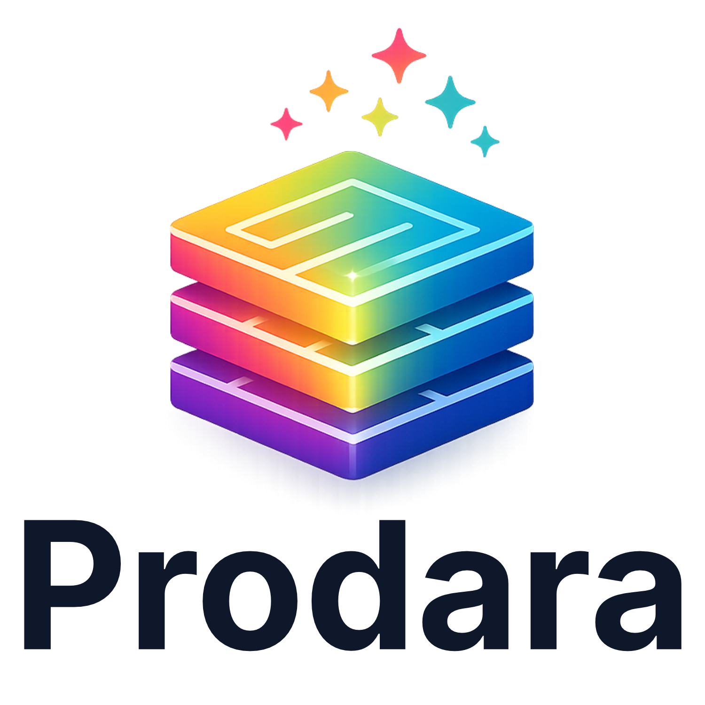

<p align="center">
  <a href="https://www.prodara.net" target="blank"></a>
</p>

<p align="center">The specification-driven product engineering system.<br/>Define your product in <code>.prd</code> files. Compile to a validated Product Graph and let AI agents build it.</p>

<p align="center">
  <a href="https://www.npmjs.com/package/@prodara/cli"></a>
  <a href="https://www.npmjs.com/package/@prodara/cli"></a>
  <a href="https://github.com/prodara-ai/prodara/actions"></a>
  <a href="https://www.prodara.net"></a>
</p>

---

## What Is Prodara?

Prodara is a **local-first, AI-native product engineering system**. You describe your product in `.prd` specification files — entities, workflows, surfaces, governance, security — and the Prodara compiler turns that specification into a **validated Product Graph**: a deterministic, machine-readable blueprint that any AI agent can consume.

**For product teams**: Write what your product should do in structured plain text. The compiler catches inconsistencies, missing rules, and broken relationships before any code is written.

**For AI agents**: Get a reproducible JSON graph with 42 edge types, incremental plans, and deterministic builds. No hallucination of requirements — the spec is the single source of truth.

```
.prd specification → Compiler (13 phases) → Product Graph → AI agents build it
```

## Quick Start

```bash
# Install
npm install -g @prodara/cli
npm install @prodara/compiler

# Create a project
prodara init my-product --template saas
cd my-product

# Build: validate → graph → plan → workflow → review → verify
prodara build

# Or run individual phases
prodara validate          # Type-check .prd files
prodara graph -o graph.json  # Emit Product Graph
prodara plan              # Generate incremental plan
prodara test              # Run spec tests
prodara diff              # Show semantic changes
```

## Table of Contents

- [What Is Prodara?](#what-is-prodara)
- [Quick Start](#quick-start)
- [Features](#features)
- [The .prd Language](#the-prd-language)
- [Compilation Pipeline](#compilation-pipeline)
- [CLI Commands](#cli-commands)
- [AI Agent Integration](#ai-agent-integration)
- [VS Code Extension](#vs-code-extension)
- [Programmatic API](#programmatic-api)
- [Packages](#packages)
- [Configuration](#configuration)
- [Testing](#testing)
- [Development](#development)
- [Documentation](#documentation)
- [Contributing](#contributing)
- [Support](#support)
- [License](#license)

## Features

### Specification Language
- **31 declaration types** — entity, workflow, surface, action, event, rule, actor, capability, enum, value object, integration, transport, storage, and more
- **Constitution & governance** — Encode security policies, privacy rules, and architectural constraints at the spec level
- **Specification tests** — Validate transitions, authorization, and invariants directly in `.prd` files

### Compiler
- **13-phase compilation pipeline** — Lexer → Parser → Binder → Checker → Validator → Graph Builder → Graph Validator → Registry → Differ → Impact Propagation → Planner → Incremental Spec → Test Runner
- **Product Graph** — Typed nodes and 42 edge types capturing every relationship in your product
- **Semantic diffing** — Classifies changes as structural, behavioral, or policy; propagates impact across the graph
- **900+ diagnostic codes** across 16 categories with source locations and suggested fixes
- **Deterministic builds** — Same input always produces the same SHA-256–hashed graph

### Workflow Engine
- **6 deterministic phases** — Specify → Clarify → Plan → Tasks → Analyze → Implement
- **9 built-in reviewer agents** — Architecture, Security, Code Quality, Test Quality, UX, Specification, Adversarial, Edge Case, and Quality reviewers
- **Review/fix loop** — Iterative review cycles with configurable severity thresholds
- **Party Mode** — Multi-agent consensus review with architect, security, developer, QA, and UX roles

### AI Agent Integration
- **26 supported AI platforms** — Copilot, Claude, Cursor, Gemini, Windsurf, Codex, Kiro, Jules, Amp, Roo, Aider, Cline, Continue, Zed, Bolt, Aide, Trae, Augment, Sourcegraph, TabNine, Supermaven, Void, PearAI, Double, OpenCode, and a generic adapter
- **29 slash commands** — Build, validate, specify, plan, implement, review, explore, party, add-entity, add-workflow, explain, and more
- **Machine-readable output** — Every command supports `--format json` for structured AI consumption
- **Headless API driver** — No UI required; agents drive builds via CLI or programmatic API

### Tooling
- **VS Code extension** — Syntax highlighting, diagnostics, completions, hover, go-to-definition, find references, graph visualizer
- **Language Server (LSP)** — Full LSP implementation with incremental text sync and cross-file semantic analysis
- **Change proposals** — Isolated propose → validate → apply → archive workflow for safe spec changes
- **Extension system** — Install custom reviewers, generators, and validators via npm

## The .prd Language

Prodara specifications are written in `.prd` files using a structured, human-readable syntax:

```
module billing {

  entity Invoice {
    amount:   currency
    status:   draft | sent | paid | overdue
    customer: Customer
    items:    list<LineItem>

    workflow lifecycle {
      draft -> sent:    send
      sent  -> paid:    mark_paid
      sent  -> overdue: mark_overdue
    }
  }

  value LineItem {
    product:  string
    quantity: integer
    price:    currency
  }

  surface InvoiceDashboard {
    kind: dashboard
    shows: Invoice
    actions: [send, mark_paid]
  }

  test "invoices start as draft" {
    given: Invoice
    expect_initial_state: draft
  }

  constitution {
    security {
      authentication: required
    }
    privacy {
      pii_fields: [customer]
      retention: "90 days"
    }
  }
}
```

### Declaration Types

| Category | Types |
|----------|-------|
| **Domain** | `entity`, `value`, `enum`, `rule`, `actor`, `capability` |
| **Behavior** | `workflow`, `action`, `event`, `schedule` |
| **Surface** | `surface`, `rendering`, `tokens`, `theme`, `strings` |
| **Infrastructure** | `integration`, `transport`, `storage`, `execution`, `serialization` |
| **Governance** | `constitution`, `security`, `privacy`, `validation`, `secret`, `environment`, `deployment` |
| **Testing** | `test` |
| **Composition** | `import`, `extension`, `product_ref` |

## Compilation Pipeline

```
.prd files
    │
    ▼
┌──────────┐    ┌──────────┐    ┌──────────┐    ┌──────────┐    ┌──────────┐
│ Discovery │───▶│  Lexer   │───▶│  Parser  │───▶│  Binder  │───▶│ Checker  │
└──────────┘    └──────────┘    └──────────┘    └──────────┘    └──────────┘
                                                                      │
    ┌─────────────────────────────────────────────────────────────────┘
    ▼
┌──────────┐    ┌──────────┐    ┌──────────┐    ┌──────────┐    ┌──────────┐
│  Graph   │───▶│  Graph   │───▶│ Registry │───▶│  Differ  │───▶│ Planner  │
│ Builder  │    │Validator │    │Resolution│    │ + Impact │    │          │
└──────────┘    └──────────┘    └──────────┘    └──────────┘    └──────────┘
                                                                      │
    ┌─────────────────────────────────────────────────────────────────┘
    ▼
┌──────────┐    ┌──────────┐    ┌──────────┐    ┌──────────┐
│Incremental│───▶│ Workflow │───▶│ Review / │───▶│ Verify   │
│   Spec   │    │  Engine  │    │ Fix Loop │    │          │
└──────────┘    └──────────┘    └──────────┘    └──────────┘
```

| Phase | What It Does |
|-------|-------------|
| **Discovery** | Recursively finds `.prd` files, computes stable SHA-256 file hashes |
| **Lexer** | Tokenizes source into typed tokens with source locations |
| **Parser** | Recursive-descent + Pratt parser builds a fully-typed AST |
| **Binder** | Resolves symbols across modules, handles imports and aliases |
| **Checker** | Type analysis, semantic validation, governance rule enforcement |
| **Graph Builder** | Constructs typed nodes and 42 edge types |
| **Graph Validator** | Validates invariants: endpoints exist, no cycles, module consistency |
| **Registry** | Resolves constitution packages and presets |
| **Differ** | Classifies changes (added, removed, structural, behavioral, policy) and propagates impact |
| **Planner** | Produces tasks: generate, regenerate, remove, or verify per impacted node |
| **Incremental Spec** | Enriches plan with node metadata and produces 6 category slices |
| **Workflow Engine** | Runs 6 deterministic phases with topological task ordering |
| **Review/Fix Loop** | Up to 9 reviewer agents with iterative fix cycles |
| **Verification** | Final gate: graph integrity, task coverage, review acceptance |

## CLI Commands

### Build & Compilation

```bash
prodara build [path]       # Full pipeline (default command)
prodara validate [path]    # Parse + type-check only
prodara graph [path]       # Emit Product Graph
prodara plan [path]        # Generate incremental plan
prodara diff [path]        # Semantic diff (--semantic for enriched view)
prodara test [path]        # Run spec tests
prodara review [path]      # Run reviewer pipeline
prodara watch [path]       # Watch mode — recompile on change
```

### Project Management

```bash
prodara init [name]                # Scaffold project (--template saas|minimal|marketplace|internal-tool|api)
prodara init --ai copilot          # Generate slash commands for an AI agent
prodara propose "Add payments"     # Create change proposal
prodara changes                    # List active proposals
prodara apply <proposal>           # Apply proposal after validation
prodara archive <proposal>         # Archive completed proposal
```

### Analysis & Inspection

```bash
prodara doctor             # Installation & workspace health check
prodara dashboard [path]   # Project overview with aggregate stats
prodara drift [path]       # Detect spec drift since last build
prodara analyze [path]     # Cross-spec consistency analysis (--threshold)
prodara checklist [path]   # Quality validation checklist
prodara explain <node>     # Explain a node in the Product Graph
prodara why <code>         # Explain a diagnostic code
prodara clarify [path]     # Run clarify phase (--auto for auto-resolution)
prodara onboard [path]     # Generate guided project walkthrough
prodara history            # Browse past build runs (--last, --status)
prodara docs [path]        # Generate markdown documentation
```

### Extensions & Presets

```bash
prodara extension list              # List installed extensions
prodara extension add <name>        # Install extension from npm
prodara extension remove <name>     # Remove extension
prodara preset list                 # List installed presets
prodara preset add <name>           # Install preset
prodara preset remove <name>        # Remove preset
```

> All commands support `--format json` for machine-readable output. Exit code `0` = success, `1` = errors.

## AI Agent Integration

Prodara is built for AI agents. Every command produces deterministic, machine-readable output:

```bash
# Any agent can drive the full pipeline
prodara build --format json ./my-project

# Or consume individual artifacts
prodara graph --format json ./my-project    # → Product Graph JSON
prodara plan --format json ./my-project     # → Incremental plan JSON
prodara diff --format json ./my-project     # → Semantic diff JSON
```

### 26 Supported AI Platforms

Generate platform-specific slash command files with a single command:

```bash
prodara init --ai copilot     # GitHub Copilot
prodara init --ai claude      # Anthropic Claude
prodara init --ai cursor      # Cursor IDE
prodara init --ai gemini      # Google Gemini
prodara init --ai windsurf    # Windsurf IDE
# ... and 21 more platforms
```

### 29 Slash Commands

AI agents get 29 commands organized by workflow:

| Category | Commands |
|----------|----------|
| **Workflow** | `/build`, `/validate`, `/constitution`, `/specify`, `/plan`, `/implement`, `/clarify`, `/review`, `/propose`, `/explore`, `/party` |
| **Editing** | `/add-module`, `/add-entity`, `/add-workflow`, `/add-screen`, `/add-policy`, `/rename`, `/move` |
| **Query** | `/explain`, `/why`, `/graph`, `/diff`, `/drift`, `/analyze`, `/checklist` |
| **Management** | `/help`, `/onboard`, `/extensions`, `/presets` |

### Design Principles for Agents

- **Deterministic** — Same `.prd` input always produces the same graph output
- **Machine-readable** — JSON output for every command, structured diagnostics
- **No interactive input** — Fully headless; agents drive via CLI or API
- **Stable exit codes** — `0` success, `1` errors; diagnostics on stderr, data on stdout

See [docs/agent-integration.md](docs/agent-integration.md) for the full orchestration contract.

## VS Code Extension

The `prodara-vscode` extension provides a first-class editing experience:

- **Syntax highlighting** — Full TextMate grammar for `.prd` files
- **Real-time diagnostics** — Errors and warnings as you type
- **Smart completions** — Context-aware completions triggered on `.` and `:`
- **Hover information** — Type and documentation on hover
- **Go to definition** — Jump to entity, workflow, and surface declarations
- **Find references** — Locate all usages across files
- **Document outline** — Navigate by module, entity, workflow, surface
- **Graph visualizer** — Interactive Product Graph visualization
- **8 commands** — Build, Validate, Show Graph, Show Plan, Drift, Diff, Explain, Graph Visualizer

Install from the [VS Code Marketplace](https://marketplace.visualstudio.com/items?itemName=prodara.prodara-vscode) or search "Prodara" in extensions.

## Programmatic API

Embed the compiler in your own tools:

```typescript
import {
  compile,
  buildGraph,
  createPlan,
  runSpecTests,
  formatDiagnosticsJson,
  serializeGraph,
  sliceGraph,
  sliceAllCategories,
  validateGraph,
  resolveConstitutions,
  buildIncrementalSpec,
  serializeIncrementalSpec,
  runWorkflow,
  runReviewers,
  runReviewFixLoop,
  verify,
  loadConfig,
  resolveConfig,
  DEFAULT_REVIEWERS,
} from '@prodara/compiler';

// Compile and get the Product Graph
const result = compile('./my-project');
if (result.diagnostics.hasErrors) {
  console.error(formatDiagnosticsJson(result.diagnostics));
  process.exit(1);
}

// Serialize the graph
const graphJson = serializeGraph(result.graph!);

// Category-based graph slicing for generators
const slices = sliceAllCategories(result.graph!);

// Run the workflow engine
const config = loadConfig('./my-project');
const spec = buildIncrementalSpec(result.plan!, result.graph!);
const workflow = runWorkflow(result.graph!, spec, config.config);

// Review and verify
const review = runReviewFixLoop(DEFAULT_REVIEWERS, config, result.graph!, spec, 3);
const verification = verify(result.graph!, spec, workflow, review.cycles);
```

## Packages

This repository is an [npm workspaces](https://docs.npmjs.com/cli/using-npm/workspaces) monorepo:

| Package | Description |
|---------|-------------|
| [`@prodara/compiler`](packages/compiler/) | Compiler, workflow engine, reviewer agents, CLI, and programmatic API |
| [`@prodara/cli`](packages/cli/) | Global CLI wrapper — resolves project-local compiler and delegates |
| [`@prodara/templates`](packages/templates/) | Prompt templates for 6 workflow phases, 9 reviewers, 26 AI platforms |
| [`@prodara/lsp`](packages/lsp/) | Language Server Protocol — diagnostics, completions, hover, definitions, references |
| [`@prodara/specification`](packages/specification/) | Language spec, examples, model docs, registry definitions |
| [`prodara-vscode`](packages/vscode/) | VS Code extension with TextMate grammar, LSP client, and 8 commands |

## Configuration

All settings are optional — sensible defaults are built in.

```jsonc
// prodara.config.json
{
  "phases": {
    "clarify": { "maxQuestions": 10, "minimumQuestionPriority": "medium" }
  },
  "reviewFix": {
    "maxIterations": 3,
    "fixSeverity": ["critical", "error"],
    "parallel": true
  },
  "preReview": {
    "enabled": false,
    "maxIterations": 2
  },
  "reviewers": {
    "architecture": { "enabled": true },
    "security": { "enabled": true },
    "codeQuality": { "enabled": true },
    "testQuality": { "enabled": true },
    "uxQuality": { "enabled": true },
    "adversarial": { "enabled": false },
    "edgeCase": { "enabled": false }
  },
  "validation": {
    "lint": "npm run lint",
    "test": "npm test",
    "build": "npm run build"
  },
  "agent": { "provider": "openai", "defaultModel": "gpt-4" },
  "audit": { "enabled": true },
  "constitution": { "path": "./constitution.prd" },
  "workflows": {
    "quick": { "phases": ["specify", "plan", "implement"] }
  }
}
```

## Testing

The test suite covers every subsystem:

| Metric | Value |
|--------|-------|
| **Total tests** | 1,096+ across 50 test files |
| **Coverage** | 100% lines, branches, functions, statements |
| **Packages tested** | compiler, lsp, templates |

### Test Categories

| Category | Files | What's Tested |
|----------|-------|---------------|
| **Compiler core** | lexer, parser, binder, checker | Tokenization, AST construction, symbol resolution, type analysis |
| **Graph** | graph, graph-validator, planner | Product Graph construction, 42 edge types, diffing, impact propagation |
| **Engine** | workflow, reviewers, verification | 6 phases, 9 reviewers, review/fix loop, integrity checks |
| **CLI** | cli, pipeline, orchestrator | All 41 commands, build orchestration, summary formatting |
| **Features** | incremental, proposals, drift, checklist, analyze | Incremental spec, change proposals, drift detection, quality analysis |
| **Infrastructure** | config, discovery, build-state, registry | Configuration, file discovery, state persistence, presets |
| **Integration** | integration, runtime, agent | End-to-end fixture-based compilation, environment resolution |
| **LSP** | lsp, semantic | Diagnostics, completions, hover, definitions, references |
| **Templates** | templates | All phase templates, reviewer perspectives, 26 platform adapters |

### TypeScript Strictness

```jsonc
// tsconfig.json
{
  "strict": true,
  "noUncheckedIndexedAccess": true,
  "noImplicitReturns": true,
  "noFallthroughCasesInSwitch": true,
  "noPropertyAccessFromIndexSignature": true
  // Zero `any` types in source
}
```

## Development

```bash
npm install             # Install workspace dependencies
npm run build           # Compile TypeScript (all packages)
npm test                # Run full test suite
npm run test:coverage   # Run with coverage (enforces 100%)
npm run typecheck       # Type-check all packages
npm run clean           # Remove dist/ directories
```

### Repository Structure

```
prodara/
├── packages/
│   ├── compiler/          # @prodara/compiler — core compiler + CLI + API
│   │   ├── src/
│   │   │   ├── lexer/     # Tokenizer
│   │   │   ├── parser/    # Recursive-descent + Pratt parser
│   │   │   ├── binder/    # Symbol resolution
│   │   │   ├── checker/   # Type checking + semantic validation
│   │   │   ├── graph/     # Product Graph builder + validator
│   │   │   ├── planner/   # Differ + impact propagation + planner
│   │   │   ├── workflow/  # 6-phase workflow engine
│   │   │   ├── reviewers/ # 9 built-in reviewer agents
│   │   │   ├── cli/       # Commander-based CLI (41 commands)
│   │   │   └── ...        # incremental, verification, audit, config, ...
│   │   └── test/          # 45 test suites
│   ├── cli/               # @prodara/cli — global wrapper
│   ├── templates/         # @prodara/templates — prompts for phases + reviewers
│   ├── lsp/               # @prodara/lsp — Language Server Protocol
│   ├── vscode/            # prodara-vscode — VS Code extension
│   └── specification/     # @prodara/specification — language spec + examples
├── examples/              # Example .prd projects
├── docs/                  # Architecture and usage documentation
└── website/               # www.prodara.net website (Angular)
```

## Documentation

- **Website**: [www.prodara.net](https://www.prodara.net) — Tutorials, language reference, and API docs
- **Architecture**: [docs/architecture.md](docs/architecture.md) — System design and compilation pipeline
- **Agent Integration**: [docs/agent-integration.md](docs/agent-integration.md) — AI agent orchestration contract
- **CLI Usage**: [docs/cli-usage.md](docs/cli-usage.md) — Full command reference
- **Plan Format**: [docs/plan-format.md](docs/plan-format.md) — Incremental plan artifact specification
- **Diagnostics**: [docs/diagnostics.md](docs/diagnostics.md) — Error code reference
- **Product Graph**: [docs/product-graph.md](docs/product-graph.md) — Graph schema and edge types

## Contributing

We welcome contributions! See [CONTRIBUTING.md](CONTRIBUTING.md) for:

- Development setup
- Code conventions and TypeScript strictness rules
- Test requirements (100% coverage enforced)
- Pull request workflow

## Support

- **Issues**: [github.com/prodara-ai/prodara/issues](https://github.com/prodara-ai/prodara/issues)
- **Security**: See [SECURITY.md](SECURITY.md) for responsible disclosure
- **Enterprise**: Contact [support@prodara.net](mailto:support@prodara.net) for dedicated support

## License

[Apache](LICENSE)
